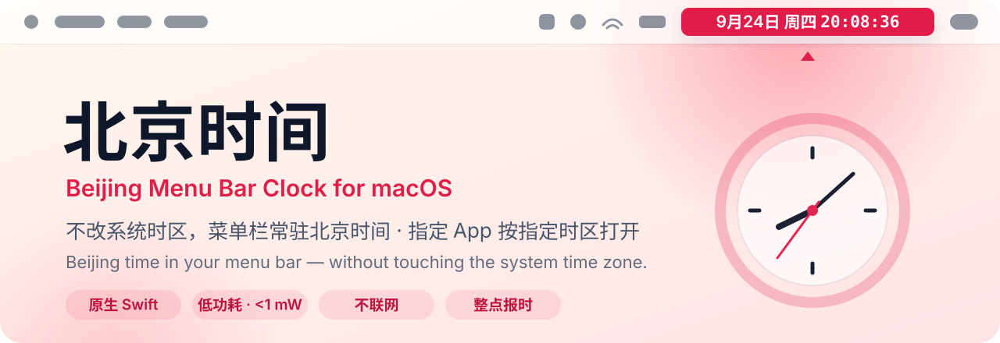
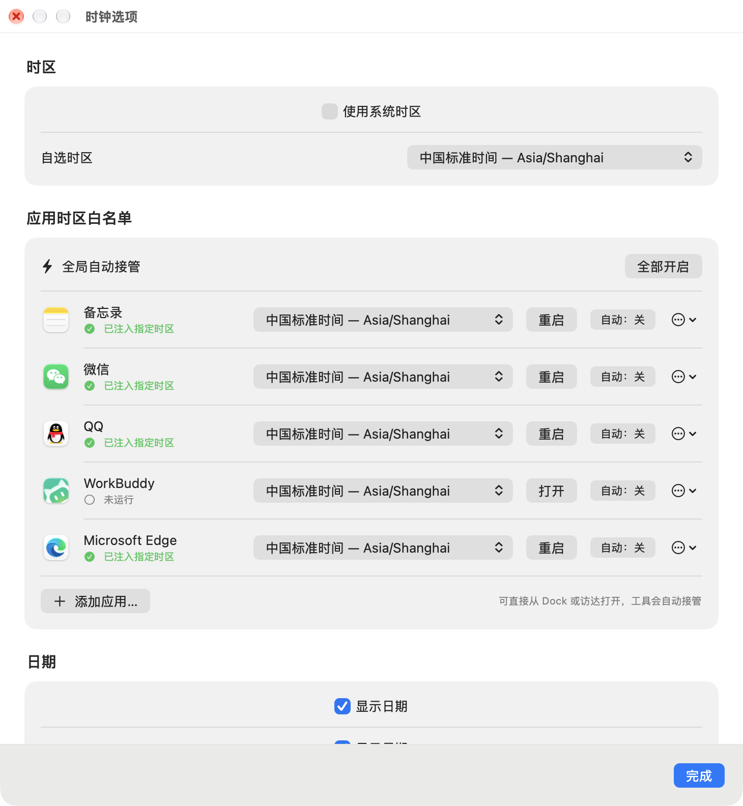

<p align="center">
  <picture>
    <source media="(prefers-color-scheme: dark)" srcset="docs/assets/banner-dark.svg">
    
  </picture>
</p>

<p align="center">
  
  
  
  
</p>

<p align="center">
  <b>中文</b> · <a href="#english">English</a>
</p>

---

**北京时间**是一个原生 macOS 菜单栏时钟：人在海外、系统时区不用动，菜单栏里始终显示北京时间。它还能让微信、QQ 这类指定 App 按北京时区启动，聊天记录和日程里的时间不再需要心算换算。

<p align="center">
  
</p>

## ✨ 亮点

| | |
|---|---|
| 🕗 **不动系统时区** | 系统保持当地时间，菜单栏单独显示北京时间（或任意时区）。 |
| 🧭 **App 级时区** | 把微信、QQ、备忘录等加入白名单，一键按指定时区重新打开，并实时显示是否已生效。 |
| ⚡ **自动接管** | 可选：从 Dock 或访达正常打开的白名单 App，会被自动切换到指定时区。基于系统事件，不轮询。 |
| 🔔 **整点报时** | 每小时、每半小时或每刻钟语音报时，可选系统提示音或自定义声音。 |
| 🔋 **低功耗** | 原生 AppKit 实现，实测稳定运行时平均不到 1 mW，与常见菜单栏小工具同一量级。 |
| 🔒 **不联网** | 不联网、不定位、不收集任何数据，没有 Dock 图标。 |

## 🖼 设置界面

<p align="center">
  
</p>

## 🚀 安装

需要 macOS 14 或更高版本，以及 Xcode 命令行工具（没装过的话，在终端运行 `xcode-select --install`）。

```bash
git clone https://github.com/Functionhx/beijing-menu-bar-clock.git
cd beijing-menu-bar-clock
./install.sh
```

安装脚本会编译 App、放到 `~/Applications`，并设置为开机自动启动。

如果菜单栏里没出现时钟，打开 **系统设置 → 菜单栏 → 允许在菜单栏中显示**，打开 **北京时间**。

只想编译不安装：运行 `./build.sh`，App 会生成在 `build/Beijing Clock.app`。

<details>
<summary><b>完整功能列表</b></summary>

- 原生 AppKit 菜单栏 + SwiftUI 设置窗口
- 可选 macOS 时区库里的任意时区，重启后保留
- 可选"使用系统时区"模式
- App 时区白名单：原生选择器添加 App，每个 App 可单独设置时区
- 从菜单栏快速打开白名单 App
- 实时检测运行中的白名单 App 是否已拿到指定时区
- 可选的自动接管：从 Dock / 访达正常打开的 App 也会被切换
- 一键全局开关自动接管，也可逐个 App 设置
- 可选显示日期、星期、秒，时间分隔符可闪烁
- 每小时 / 半小时 / 刻钟语音报时，内置提示音或自定义音频
- 开机自动启动，无 Dock 图标，不联网

本工具只做数字时钟，不提供指针表盘模式。

</details>

<details>
<summary><b>隐私与工作原理</b></summary>

App 不使用定位，也不联网。它读取系统时钟，再按设置里选择的时区（默认 `Asia/Shanghai`）格式化显示。开启"使用系统时区"后，以 macOS 当前时区为准。

对白名单 App，时钟会请求 macOS 启动一个新的 App 进程，并带上 `TZ` 环境变量和一个本地校验标记，目标 App 本身不会被修改。设置窗口通过读取运行中进程的环境变量，区分"已按指定时区启动"和"正常打开"的 App。这只对遵循标准时区环境变量的 App 有效，而且只在从本时钟启动时生效；有些 App 可能仍使用系统时区，或显示服务器格式化好的时间。

自动接管需要逐个 App 手动开启。开启后，时钟监听 macOS 的 App 启动和退出事件：白名单 App 如果被正常打开、没有带校验标记，会被请求退出并立即按指定时区重新打开。进程启动后就不再检查，直到下一次启动或退出事件，不做持续轮询。自动接管不会强制退出 App。

</details>

---

<a id="english"></a>

## English

**Beijing Menu Bar Clock** is a small native macOS menu bar clock that always shows Beijing time (`Asia/Shanghai`) — or any time zone you pick — without changing the system time zone. It can also relaunch selected apps (WeChat, QQ, Notes, …) in a chosen time zone and verify that it took effect.

### Highlights

- **Leave the system alone** — your Mac keeps local time; the menu bar shows Beijing time.
- **Per-app time zones** — allowlist apps and reopen them in a chosen time zone, with live status.
- **Automatic takeover** (opt-in) — apps opened normally from the Dock or Finder are switched automatically. Event-driven, no polling.
- **Spoken announcements** — every hour, half hour, or quarter hour, with built-in or custom sounds.
- **Low power** — native AppKit; measured under 1 mW on average in steady state.
- **Private** — no network, no location, no Dock icon.

### Install

Requires macOS 14+ and the Xcode Command Line Tools.

```bash
git clone https://github.com/Functionhx/beijing-menu-bar-clock.git
cd beijing-menu-bar-clock
./install.sh
```

The installer builds the app, copies it to `~/Applications`, and adds a per-user LaunchAgent so it starts at login. If the clock doesn't appear, enable it under **System Settings → Menu Bar → Allow in the Menu Bar → Beijing Time**.

To build without installing, run `./build.sh`; the app is created at `build/Beijing Clock.app`.

### Privacy

The app reads the system clock and formats it with the selected time zone; it never uses Location Services or the network. For allowlisted apps, it asks macOS to launch a fresh process with a `TZ` environment value and a local verification marker — the target app is not modified. This only affects apps that honor the standard time-zone environment and only when launched from this clock. Automatic takeover is opt-in per app, listens for launch/termination events only, and never force-quits an app.

## License

[MIT](LICENSE)
