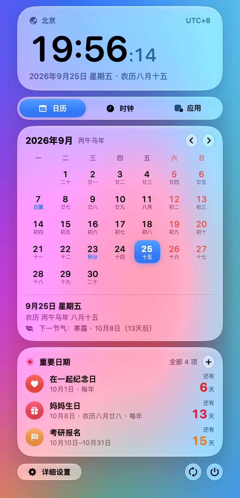
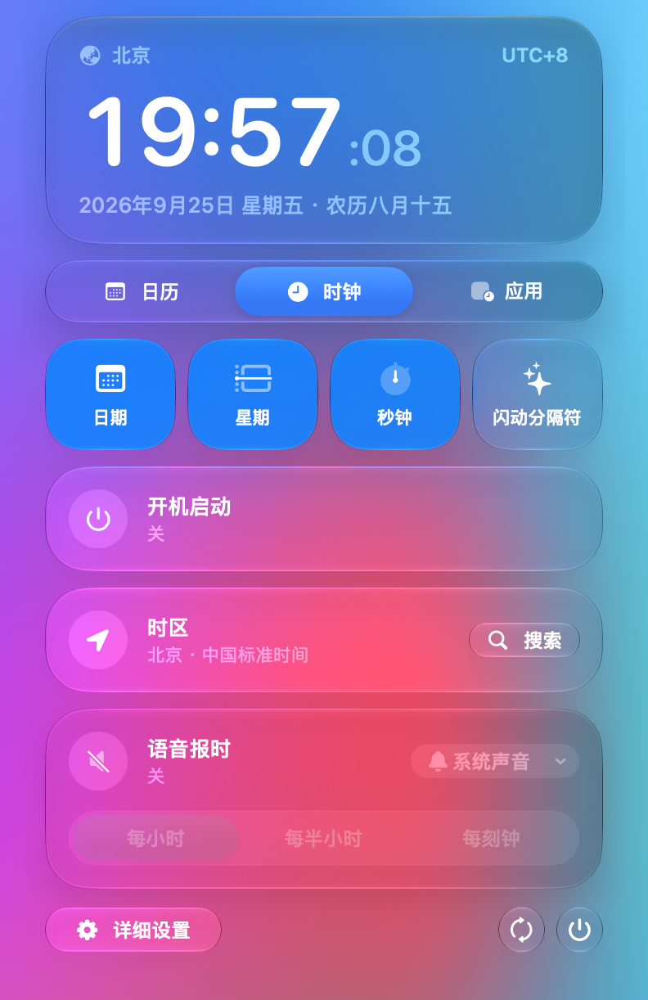

<p align="center">
  <picture>
    <source media="(prefers-color-scheme: dark)" srcset="docs/assets/banner-dark.svg">
    
  </picture>
</p>

<p align="center">
  
  
  
  
  
</p>

<p align="center">
  <b>中文</b> · <a href="#english">English</a>
</p>

---

**北京时间**是一个原生 macOS 菜单栏时钟：人在海外、系统时区不用动，菜单栏里始终显示北京时间。点一下时钟，弹出液态玻璃面板：农历月历、重要日期倒计时、常用设置都在里面。它还能让微信、QQ 这类指定 App 按北京时区启动，聊天记录和日程里的时间不再需要心算换算。

<p align="center">
  
</p>

<p align="center">
  
  &nbsp;&nbsp;
  
</p>

## ✨ 亮点

<table>
<tr><td width="160">🕗 <b>不动系统时区</b></td><td>系统保持当地时间，菜单栏单独显示北京时间（或任意时区），支持中英文城市名、缩写和 GMT+8 搜索时区。</td></tr>
<tr><td>🫧 <b>液态玻璃面板</b></td><td>左键点时钟弹出 macOS 26 风格的面板，分「日历 / 时钟 / 应用」三页，常用设置直接在面板里改；右键仍是经典菜单。</td></tr>
<tr><td>📅 <b>农历月历</b></td><td>月历里每天标注农历和二十四节气，离线计算，不联网。</td></tr>
<tr><td>⭐ <b>重要日期</b></td><td>生日（支持农历生日）、纪念日、考试、报名截止……可以是某一天、某个时间段或每年重复，面板里显示倒计时，到期前用系统通知提醒。</td></tr>
<tr><td>🧭 <b>App 级时区</b></td><td>把微信、QQ、备忘录等加入白名单，一键按指定时区重新打开，并实时显示是否已生效；可选自动接管从 Dock 打开的 App。</td></tr>
<tr><td>🔔 <b>整点报时</b></td><td>每小时、每半小时或每刻钟语音报时，可选系统提示音或自定义声音。</td></tr>
<tr><td>🔋 <b>低功耗</b></td><td>面板关闭时不跑任何界面代码。不显示秒时每分钟只唤醒一次，实测空闲 CPU 约 0.02%；显示秒时约 1%，几乎都是系统重绘菜单栏的开销。</td></tr>
<tr><td>🔒 <b>隐私</b></td><td>只在检查更新时访问 GitHub，不定位、不收集任何数据，没有 Dock 图标。</td></tr>
</table>

## 🖼 详细设置

<p align="center">
  
</p>

## 🚀 安装

### 下载

到 [Releases](https://github.com/Functionhx/beijing-menu-bar-clock/releases/latest) 下载最新的 `BeijingClock-x.y.z.zip`，解压后把 **Beijing Clock.app** 拖进「应用程序」。

这个 App 没有 Apple 开发者签名，第一次打开时 macOS 会拦截：在 **系统设置 → 隐私与安全性** 底部点「仍要打开」即可，之后不会再问。以后的版本会通过内置的自动更新安装（更新包带 EdDSA 签名校验）。

需要 macOS 26 或更高版本。

### 从源码编译

需要 Xcode 和 [XcodeGen](https://github.com/yonaskolb/XcodeGen)（`brew install xcodegen`）。首次编译会自动下载 Sparkle 更新框架。

```bash
git clone https://github.com/Functionhx/beijing-menu-bar-clock.git
cd beijing-menu-bar-clock
./install.sh
```

安装脚本会编译 App、放到 `~/Applications`，并设置为开机自动启动（可在面板「时钟」页关闭）。

如果菜单栏里没出现时钟，打开 **系统设置 → 菜单栏 → 允许在菜单栏中显示**，打开 **北京时间**。

只想编译不安装：运行 `./build.sh`，App 会生成在 `build/Beijing Clock.app`。开发时可以用 `scripts/test-logic.sh` 跑日期逻辑测试，用 `scripts/panel-harness.sh` 在独立进程里打开面板、回放点击和截图（不影响已安装的 App）。

## 📦 发布 / 签名 / 自动更新

自动更新基于 [Sparkle](https://sparkle-project.org)：App 每天读取一次 `main` 分支上的 `appcast.xml`，下载的更新包必须通过 EdDSA 签名校验才会安装。

App 的身份只在 **`Config/Branch.xcconfig`** 一个文件里配置：`BMC_BRANCH`（更新源所在分支）、`BMC_PRODUCT_NAME`、`BMC_BUNDLE_ID`、`BMC_DISPLAY_NAME`，以及版本号 `MARKETING_VERSION` / `CURRENT_PROJECT_VERSION`（每次发布都要递增）。

打包发布：

```bash
./scripts/release.sh
```

脚本会归档 → 签名 →（可选）公证 → 打 zip → 用钥匙串里的 Sparkle 私钥签名 → 更新 `appcast.xml`。它**不会**上传或推送任何东西，最后会打印需要你手动执行的 `gh release create` 和 `git push` 命令。

- **有 Apple 开发者账号（付费）**：先存一次公证凭据，再带上环境变量运行：
  ```bash
  xcrun notarytool store-credentials beijing-clock-notary --apple-id <你的 Apple ID> --team-id <TEAMID> --password <App 专用密码>
  SIGN_IDENTITY="Developer ID Application: 你的名字 (TEAMID)" NOTARY_PROFILE=beijing-clock-notary ./scripts/release.sh
  ```
  得到开启 Hardened Runtime、经过公证并装订票据的正式版本，用户首次打开不会看到 Gatekeeper 警告。
- **没有开发者账号**：直接运行，得到 ad-hoc 签名版本。自动更新照常工作（靠 Sparkle 的 EdDSA 签名保证安全），但用户第一次打开时需要在「系统设置 → 隐私与安全性」里点「仍要打开」。

> Sparkle 私钥保存在发布用 Mac 的登录钥匙串里（账户 `beijing-menu-bar-clock`）。换电脑发布前用 `Vendor/Sparkle/bin/generate_keys --account beijing-menu-bar-clock -x key.txt` 导出、在新电脑上用 `-f key.txt` 导入，导入后立刻删除 key.txt。丢失私钥将无法再向已安装的用户推送更新。

<details>
<summary><b>完整功能列表</b></summary>

- 原生 AppKit 菜单栏 + SwiftUI 液态玻璃面板和设置窗口
- 左键弹出面板（日历 / 时钟 / 应用），右键经典菜单
- 可选 macOS 时区库里的任意时区，支持搜索、最近使用；也可"使用系统时区"
- 可选显示日期、星期、秒，时间分隔符可闪烁；等宽数字，走秒时不抖动
- 农历月历：农历日期、月份、干支生肖、二十四节气，下一节气倒计时
- 重要日期：某一天（可带具体时间）、时间段、每年重复、农历每年；5 种分类；当天 / 1 / 3 / 7 / 30 天前提醒，时间段可在结束当天再提醒
- App 时区白名单：每个 App 单独设置时区，实时检测是否生效，可选自动接管
- 每小时 / 半小时 / 刻钟语音报时，内置提示音或自定义音频
- 开机自动启动，无 Dock 图标
- 基于 Sparkle 的自动更新（EdDSA 签名校验）

本工具只做数字时钟，不提供指针表盘模式。

</details>

<details>
<summary><b>隐私与工作原理</b></summary>

重要日期只保存在本机，提醒由 macOS 本地通知发出。App 不使用定位；唯一的网络访问是每天一次向 GitHub 检查更新（关闭方法：`defaults write com.chen.dualtime SUEnableAutomaticChecks -bool false`）。它读取系统时钟，再按设置里选择的时区（默认 `Asia/Shanghai`）格式化显示。开启"使用系统时区"后，以 macOS 当前时区为准。

对白名单 App，时钟会请求 macOS 启动一个新的 App 进程，并带上 `TZ` 环境变量和一个本地校验标记，目标 App 本身不会被修改。设置窗口通过读取运行中进程的环境变量，区分"已按指定时区启动"和"正常打开"的 App。这只对遵循标准时区环境变量的 App 有效，而且只在从本时钟启动时生效；有些 App 可能仍使用系统时区，或显示服务器格式化好的时间。

自动接管需要逐个 App 手动开启。开启后，时钟监听 macOS 的 App 启动和退出事件：白名单 App 如果被正常打开、没有带校验标记，会被请求退出并立即按指定时区重新打开。进程启动后就不再检查，直到下一次启动或退出事件，不做持续轮询。自动接管不会强制退出 App。

</details>

---

<a id="english"></a>

## English

**Beijing Menu Bar Clock** is a native macOS menu bar clock that always shows Beijing time (`Asia/Shanghai`) — or any time zone you pick — without changing the system time zone. Click it for a Liquid Glass panel with a lunar calendar, countdowns to important dates and quick settings. It can also relaunch selected apps (WeChat, QQ, Notes, …) in a chosen time zone and verify that it took effect.

### Highlights

- **Leave the system alone** — your Mac keeps local time; the menu bar shows Beijing time. Search zones by Chinese or English city names, abbreviations or `GMT+8`.
- **Liquid Glass panel** — left-click opens a macOS 26 style panel with 日历 / 时钟 / 应用 pages; right-click keeps the classic menu.
- **Lunar calendar** — every day shows its 农历 date and the 24 solar terms, computed offline.
- **Important dates** — birthdays (including lunar birthdays), anniversaries, exams and deadlines, as single days, periods or yearly dates, with countdowns in the panel and reminders through system notifications.
- **Per-app time zones** — allowlist apps and reopen them in a chosen time zone, with live status and optional automatic takeover.
- **Spoken announcements** — every hour, half hour, or quarter hour, with built-in or custom sounds.
- **Low power** — no UI code runs while the panel is closed. Without seconds the clock wakes once a minute (about 0.02% CPU when idle); with seconds it is about 1%, almost all of it macOS redrawing the menu bar.
- **Private** — network is used only for update checks; no location, no Dock icon.

### Install

Download `BeijingClock-x.y.z.zip` from [Releases](https://github.com/Functionhx/beijing-menu-bar-clock/releases/latest), unzip it and move **Beijing Clock.app** to Applications. The app isn't signed with an Apple Developer ID, so approve it once under **System Settings → Privacy & Security → Open Anyway**. Later versions arrive through the built-in updater. Requires macOS 26 or later.

To build from source you need Xcode and [XcodeGen](https://github.com/yonaskolb/XcodeGen) (`brew install xcodegen`); the first build downloads the Sparkle update framework.

```bash
git clone https://github.com/Functionhx/beijing-menu-bar-clock.git
cd beijing-menu-bar-clock
./install.sh
```

The installer builds the app, copies it to `~/Applications`, and adds a per-user LaunchAgent so it starts at login (turn it off on the panel's 时钟 page). If the clock doesn't appear, enable it under **System Settings → Menu Bar → Allow in the Menu Bar → Beijing Time**.

To build without installing, run `./build.sh`; the app is created at `build/Beijing Clock.app`. `scripts/test-logic.sh` runs the date logic tests, and `scripts/panel-harness.sh` hosts the panel in a separate process to replay clicks and take screenshots without touching the installed app.

### Releases, signing and auto-update

Updates are delivered with [Sparkle](https://sparkle-project.org): the app reads `appcast.xml` on `main` once a day and only installs archives whose EdDSA signature matches the public key baked into the app.

The app identity lives in **`Config/Branch.xcconfig`** only: `BMC_BRANCH` (branch that hosts the update feed), `BMC_PRODUCT_NAME`, `BMC_BUNDLE_ID`, `BMC_DISPLAY_NAME`, plus `MARKETING_VERSION` / `CURRENT_PROJECT_VERSION` (bump both for every release).

Run `./scripts/release.sh` to archive, sign, optionally notarize, zip, EdDSA-sign and prepend an item to `appcast.xml`. It never uploads or pushes; it prints the `gh release create` and `git push` commands to run yourself.

- **With a paid Apple Developer account:** store notarization credentials once with `xcrun notarytool store-credentials beijing-clock-notary --apple-id <Apple ID> --team-id <TEAMID> --password <app-specific password>`, then run `SIGN_IDENTITY="Developer ID Application: Name (TEAMID)" NOTARY_PROFILE=beijing-clock-notary ./scripts/release.sh` for a hardened-runtime, notarized and stapled build.
- **Without one:** the script signs ad-hoc. Auto-update still works and is protected by the EdDSA signature, but users have to approve the app once under **System Settings → Privacy & Security → Open Anyway**.

The Sparkle private key lives in the release Mac's login keychain (account `beijing-menu-bar-clock`). Losing it means installed copies can no longer be updated — export it with `generate_keys -x` and keep a secure backup.

### Privacy

Important dates stay on your Mac and reminders are local notifications. The app reads the system clock and formats it with the selected time zone; it never uses Location Services, and its only network access is a daily update check against GitHub (turn it off with `defaults write com.chen.dualtime SUEnableAutomaticChecks -bool false`). For allowlisted apps, it asks macOS to launch a fresh process with a `TZ` environment value and a local verification marker — the target app is not modified. This only affects apps that honor the standard time-zone environment and only when launched from this clock. Automatic takeover is opt-in per app, listens for launch/termination events only, and never force-quits an app.

## License

[MIT](LICENSE)
